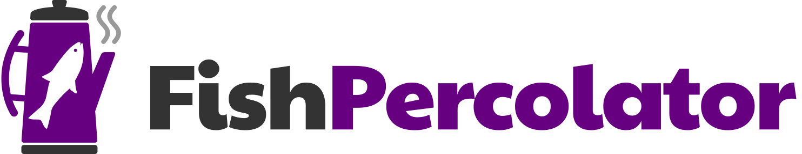

# 

**Fish Percolator** is a software development house founded in 2015 &ndash; the commercial vehicle of [Quinn Daley](https://name.pn/quinn-daley) and associates.

Our mission is to **change the world in small ways through the application of technology**.

There used to be a really fancy website here, but this one page with no bells & whistles better captures our ethos.

* [Products](#products)
* [Services](#services)
* [Open source](#open-source)
* [About Quinn](#about-quinn)
* [Contact details](#contact-details)

## Products

Fish Percolator is now focussed on the development of our own products, including:

### name.pn

**[name.pn](https://name.pn/)** is an online tool for people to create [a page with a nice URL](https://name.pn/quinn-daley) that describes everything about their name and how to use it (whether you like being addressed by a title in formal contexts, how to use your pronouns in a sentence, how to pronounce your name, what nicknames you don't like, etc.)

The dream is for it to become a place for individuals to carry this personal data with them from employer to employer and from service to service, instead of re-entering it all the time, with tools for the employers and the services themselves such as org charts and "user manuals".

In its initial form it already exists and has amassed well over 2000 active users without any marketing spend. [Read more now and sign up for an account if you haven't already!](https://name.pn/pages/about)

## Services

We fund the development of our products by taking on paid contracts and one-off consultancy work.

### Contracts

Fish Percolator (Quinn and/or associates) is available for short-term contracts of 3 to 6 months at a time. Of particular interest is:

* **Technical leadership** &ndash; typically of a small portfolio of products. Setting the direction for the technical aspects of the product (including devops), stakeholder engagement, plain-language technical communication, and community-building / recruitment &amp; retention.
* **Cultural transformation** &ndash; transforming a siloed, demoralised or low-performance team into one with a thriving community of practice and devops culture.
* **Senior/principal software engineering** &ndash; especially in the Ruby-on-Rails / AWS space where we have the most experience, but our skillset is very adaptable and will suit any web-based framework that is deployed in a public cloud or PaaS.

### Consultancy

Sometimes it makes sense to do a smaller piece of work based on a specific set of deliverables, rather than time and materials.

We're available to run workshops on cultural transformation, devops, inclusion and more, as well as pieces of technical discovery, emergency fixes to legacy applications and almost anything else you might set a senior engineer or tech lead onto.

## Open source

We're very proud of our commitment to contributing to the open source community. Some highlights of our contributions over the years include:

* The design and implementation of [one of the methods in core Rails](https://api.rubyonrails.org/classes/ActiveRecord/Migration.html#method-i-up_only)!
* Implementation of [audit features](https://github.com/codegram/spinach?tab=readme-ov-file#audit) for the Spinach BDD framework.
* The initial implementation of [authorization features in the popular Administrate library](https://administrate-demo.herokuapp.com/authorization).
* Various extensions to Administrate including the popular [LatLng field type](https://github.com/fishpercolator/administrate-field-lat_lng).
* Being named [the MVP for Fog.io's 1.37.0 release](https://github.com/fog/fog/blob/master/CHANGELOG.md) for work on their vSphere adapter
* [name.pn itself is open source](https://github.com/fishpercolator/name.pn) and welcomes contributions.

## About Quinn

[Quinn](https://name.pn/quinn-daley) is a software engineer with 20+ years of industry experience, including 13+ years in technical leadership.

### Proven leadership

From 2021 to 2024, Quinn headed up the software engineering team at [Citizens Advice](https://wearecitizensadvice.org.uk/) &ndash; a team of 40+ engineers working in multidisciplinary teams across 11 digital products. They led a cultural transformation programme that transformed the team from a collection of development silos with very high staff turnover into a true community of practice where people were collaborating across teams, staff attrition was very low, and product teams were taking ownership of (and interest in!) their own production deployments.

### This company's previous incarnation

Fish Percolator was founded as a boutique software development consultancy in 2015, building seed technology for new startups and spinoffs. In that time, Quinn was directly responsible for the design, build, testing and deployment of the initial MVPs at successful startups [Noiiz](https://www.noiiz.com/), [Improve Your Accent](https://improveyouraccent.co.uk/english-pronunciation-course/) and [Digital Urban](https://digitalurban.place/) as well as gone-but-not-forgotten Gigappy, Care View, Socialaser, Commscanner, Levy Match Leeds, Tailormade by Pecan Deluxe and many more.

This was also the time Quinn developed and released the first versions of name.pn (see [Products](#products), above).

During this period, Quinn was a finalist for [IPSE Freelancer of the Year](https://nationalfreelancersday.com/) 2017.

### Background

Prior to this, Quinn ran the Leeds Development Centre for multinational Trend Micro, with overall responsibility for every aspect of that team including systems architecture. Going back even further, they were a key part of the team developing an in-house cloud and continuous integration system at Transitive (later IBM) in the days before this was even called devops.

Quinn's leadership style is based around **inclusion** and **community-building**. It's not enough to have a diverse team &ndash; every individual has to feel they belong and can contribute to the best of their abilities, and the team has to be able to flex to take advantage of the diverse strengths it contains.

They are also known for their advocacy on behalf of marginalised team members, their unnecessary optimism and their love of Kate Bush.

You can read Quinn's full CV on [their LinkedIn page](https://www.linkedin.com/in/quinnmx).

## Contact details

<dl>
<dt>Email</dt><dd><a href="mailto:hello@fishpercolator.co.uk">hello@fishpercolator.co.uk</a></dd>
<dt>Phone</dt><dd><a href="tel:+447963043979">07963 043979</a></dd>
<dt>Post</dt><dd>Duke Studios, 3 Sheaf Street, Leeds LS10 1HD</dd>
<dt>England & Wales company</dt><dd><a href="https://find-and-update.company-information.service.gov.uk/company/09617660">#09617660</a></dd>
<dt>VAT number</dt><dd>GB 218804800</dd>
<dt>ICO registration</dt><dd>ZB138365</dd>
</dl>
